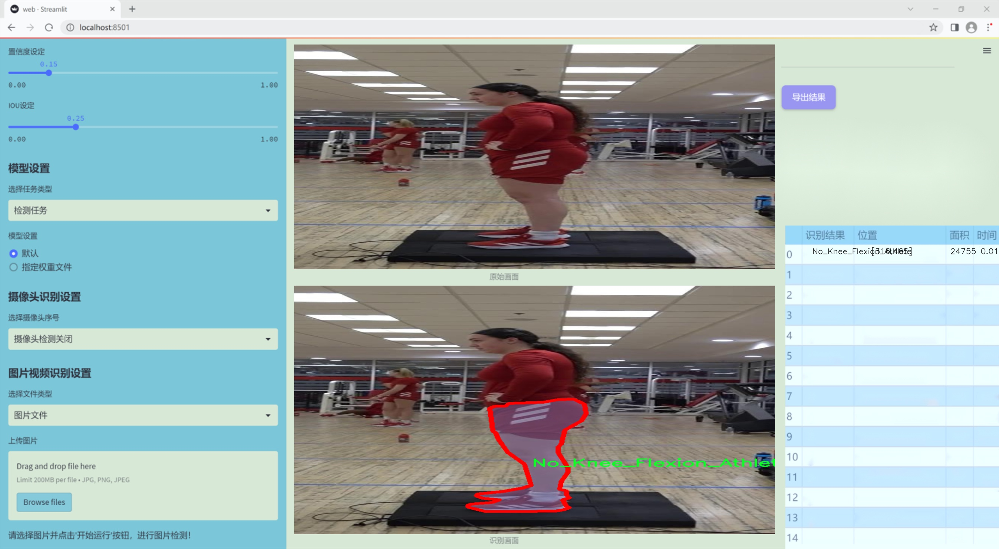
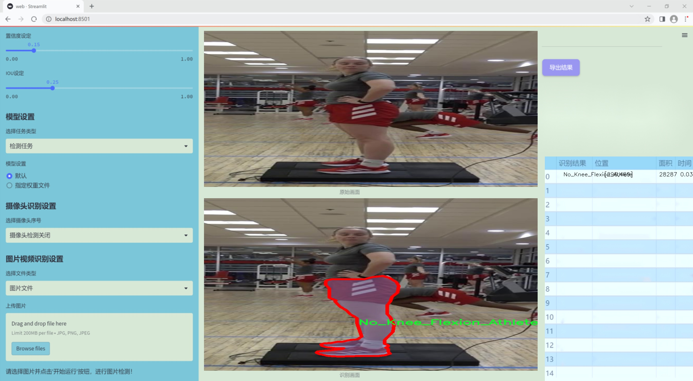
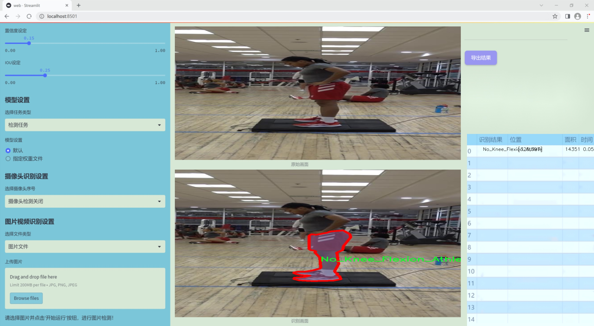
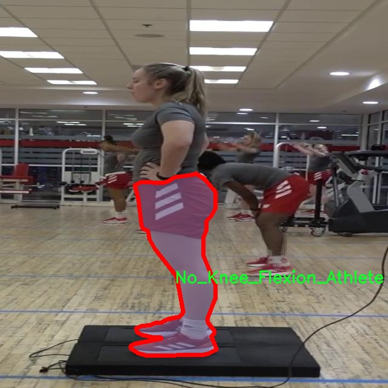
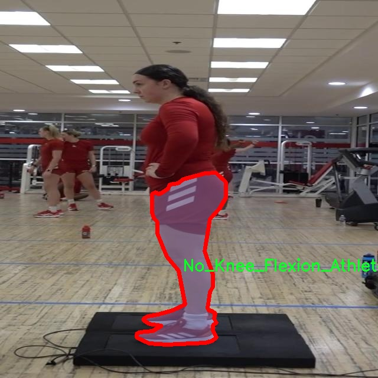
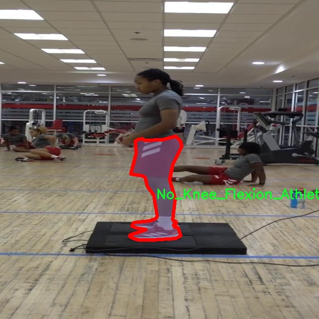
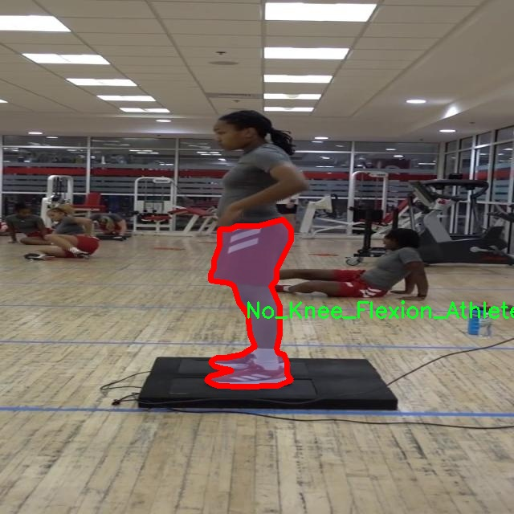

### 1.背景意义

### 研究背景与意义

膝关节屈伸运动的检测在运动医学、康复治疗及运动训练中具有重要的应用价值。随着人们对健康和运动的重视，膝关节的功能评估与运动表现分析逐渐成为研究的热点。膝关节作为人体重要的负重关节，其运动状态直接影响到运动员的表现和运动安全。因此，开发一个高效、准确的膝关节屈伸运动检测系统，不仅能够帮助运动员优化训练方案，还能为临床医生提供科学依据，以制定个性化的康复计划。

近年来，深度学习技术在计算机视觉领域取得了显著进展，尤其是目标检测和实例分割任务中，YOLO（You Only Look Once）系列模型以其快速和高效的特点被广泛应用。YOLOv11作为该系列的最新版本，进一步提升了检测精度和速度，适合实时应用场景。通过对YOLOv11的改进，结合针对膝关节屈伸运动的特定需求，可以实现对运动状态的精准识别与分析。

本研究将基于改进的YOLOv11模型，构建一个膝关节屈伸运动检测系统。数据集包含1200张经过精细标注的图像，分为“膝关节屈伸运动”和“非屈伸运动”两类。这一数据集的构建为模型的训练和评估提供了坚实的基础。通过实例分割技术，系统不仅能够识别膝关节的运动状态，还能精确定位运动过程中的关键点，从而为运动员的技术动作分析提供详细的数据支持。

综上所述，基于改进YOLOv11的膝关节屈伸运动检测系统的研究，不仅具有重要的理论意义，还具备广泛的应用前景。该系统的成功开发将为运动医学领域提供新的工具，推动运动训练和康复治疗的科学化进程。

### 2.视频效果

[2.1 视频效果](https://www.bilibili.com/video/BV1JZkEYNEb2/)

### 3.图片效果







##### [项目涉及的源码数据来源链接](https://kdocs.cn/l/cszuIiCKVNis)**

注意：本项目提供训练的数据集和训练教程,由于版本持续更新,暂不提供权重文件（best.pt）,请按照6.训练教程进行训练后实现上图演示的效果。

### 4.数据集信息

##### 4.1 本项目数据集类别数＆类别名

nc: 2
names: ['Knee_Flexion_Athlete', 'No_Knee_Flexion_Athlete']


该项目为【图像分割】数据集，请在【训练教程和Web端加载模型教程（第三步）】这一步的时候按照【图像分割】部分的教程来训练

##### 4.2 本项目数据集信息介绍

本项目数据集信息介绍

本项目旨在开发一种改进的YOLOv11膝关节屈伸运动检测系统，所使用的数据集名为“Knee_Flexion_Segmentation”。该数据集专注于膝关节屈伸运动的识别与分析，特别是在运动员群体中的应用。数据集包含两个主要类别，分别为“Knee_Flexion_Athlete”和“No_Knee_Flexion_Athlete”，这两个类别的设计旨在帮助模型有效区分运动员在进行膝关节屈伸运动时的状态与未进行该运动时的状态。

在数据集的构建过程中，研究团队收集了大量高质量的视频和图像数据，确保样本的多样性和代表性。每个类别均包含不同角度、不同环境下的运动员膝关节屈伸运动表现，涵盖了从静态到动态的多种姿态。这种丰富的数据来源不仅增强了模型的训练效果，还提高了其在实际应用中的泛化能力。此外，数据集中的样本经过精心标注，确保每一帧图像都能准确反映出运动员的膝关节状态，为后续的深度学习模型训练提供了坚实的基础。

通过对“Knee_Flexion_Athlete”和“No_Knee_Flexion_Athlete”这两个类别的深入分析，研究团队能够更好地理解膝关节屈伸运动的生物力学特征，进而优化YOLOv11模型的结构与参数设置，以实现更高的检测精度和实时性。这一数据集不仅为膝关节运动的研究提供了重要的实验基础，也为运动医学、康复训练等领域的相关研究奠定了良好的数据支持。通过不断迭代和优化，最终目标是构建一个高效、准确的膝关节屈伸运动检测系统，以助力运动员的训练与康复。










### 5.全套项目环境部署视频教程（零基础手把手教学）

[5.1 所需软件PyCharm和Anaconda安装教程（第一步）](https://www.bilibili.com/video/BV1BoC1YCEKi/?spm_id_from=333.999.0.0&vd_source=bc9aec86d164b67a7004b996143742dc)


[5.2 安装Python虚拟环境创建和依赖库安装视频教程（第二步）](https://www.bilibili.com/video/BV1ZoC1YCEBw?spm_id_from=333.788.videopod.sections&vd_source=bc9aec86d164b67a7004b996143742dc)

### 6.改进YOLOv11训练教程和Web_UI前端加载模型教程（零基础手把手教学）

[6.1 改进YOLOv11训练教程和Web_UI前端加载模型教程（第三步）](https://www.bilibili.com/video/BV1BoC1YCEhR?spm_id_from=333.788.videopod.sections&vd_source=bc9aec86d164b67a7004b996143742dc)


按照上面的训练视频教程链接加载项目提供的数据集，运行train.py即可开始训练



     Epoch   gpu_mem       box       obj       cls    labels  img_size
     1/200     20.8G   0.01576   0.01955  0.007536        22      1280: 100%|██████████| 849/849 [14:42<00:00,  1.04s/it]
               Class     Images     Labels          P          R     mAP@.5 mAP@.5:.95: 100%|██████████| 213/213 [01:14<00:00,  2.87it/s]
                 all       3395      17314      0.994      0.957      0.0957      0.0843

     Epoch   gpu_mem       box       obj       cls    labels  img_size
     2/200     20.8G   0.01578   0.01923  0.007006        22      1280: 100%|██████████| 849/849 [14:44<00:00,  1.04s/it]
               Class     Images     Labels          P          R     mAP@.5 mAP@.5:.95: 100%|██████████| 213/213 [01:12<00:00,  2.95it/s]
                 all       3395      17314      0.996      0.956      0.0957      0.0845

     Epoch   gpu_mem       box       obj       cls    labels  img_size
     3/200     20.8G   0.01561    0.0191  0.006895        27      1280: 100%|██████████| 849/849 [10:56<00:00,  1.29it/s]
               Class     Images     Labels          P          R     mAP@.5 mAP@.5:.95: 100%|███████   | 187/213 [00:52<00:00,  4.04it/s]
                 all       3395      17314      0.996      0.957      0.0957      0.0845


###### [项目数据集下载链接](https://kdocs.cn/l/cszuIiCKVNis)

### 7.原始YOLOv11算法讲解


###### YOLOv11改进方向

与YOLOv 10相比，YOLOv 11有了巨大的改进，包括但不限于：

  * 增强的模型结构：模型具有改进的模型结构，以获取图像处理并形成预测
  * GPU优化：这是现代ML模型的反映，GPU训练ML模型在速度和准确性上都更好。
  * 速度：YOLOv 11模型现在经过增强和GPU优化以用于训练。通过优化，这些模型比它们的前版本快得多。在速度上达到了25%的延迟减少！
  * 更少的参数：更少的参数允许更快的模型，但v11的准确性不受影响
  * 更具适应性：更多支持的任务YOLOv 11支持多种类型的任务、多种类型的对象和多种类型的图像。

###### YOLOv11功能介绍

Glenn Jocher和他的团队制作了一个令人敬畏的YOLOv 11迭代，并且在图像人工智能的各个方面都提供了YOLO。YOLOv 11有多种型号，包括：

  * 对象检测-在训练时检测图像中的对象
  * 图像分割-超越对象检测，分割出图像中的对象
  * 姿态检测-当用点和线训练时绘制一个人的姿势
  * 定向检测（OBB）：类似于对象检测，但包围盒可以旋转
  * 图像分类-在训练时对图像进行分类

使用Ultralytics Library，这些模型还可以进行优化，以：

  * 跟踪-可以跟踪对象的路径
  * 易于导出-库可以以不同的格式和目的导出
  * 多场景-您可以针对不同的对象和图像训练模型

此外，Ultralytics还推出了YOLOv 11的企业模型，该模型将于10月31日发布。这将与开源的YOLOv
11模型并行，但将拥有更大的专有Ultralytics数据集。YOLOv 11是“建立在过去的成功”的其他版本的之上。

###### YOLOv11模型介绍

YOLOv 11附带了边界框模型（无后缀），实例分割（-seg），姿态估计（-pose），定向边界框（-obb）和分类（-cls）。

这些也有不同的尺寸：纳米（n），小（s），中（m），大（l），超大（x）。


YOLOv11模型

###### YOLOv11与前版本对比

与YOLOv10和YOLOv8相比，YOLOv11在Ultralytics的任何帖子中都没有直接提到。所以我会收集所有的数据来比较它们。感谢Ultralytics：

**检测：**


YOLOv11检测统计


YOLOv10检测统计

其中，Nano的mAPval在v11上为39.5，v10上为38.5；Small为47.0 vs 46.3，Medium为51.5 vs
51.1，Large为53.4 vs 53.2，Extra Large为54.7vs
54.4。现在，这可能看起来像是一种增量增加，但小小数的增加可能会对ML模型产生很大影响。总体而言，YOLOv11以0.3
mAPval的优势追平或击败YOLOv10。

现在，我们必须看看速度。在延迟方面，Nano在v11上为1.55 , v10上为1.84，Small为2.46 v2.49，Medium为4.70
v4.74，Large为6.16 v7.28，Extra Large为11.31
v10.70。延迟越低越好。YOLOv11提供了一个非常低的延迟相比，除了特大做得相当差的前身。

总的来说，Nano模型是令人振奋的，速度更快，性能相当。Extra Large在性能上有很好的提升，但它的延迟非常糟糕。

**分割：**


YOLOV11 分割统计


YOLOV9 分割统计


YOLOV8 分割数据

总体而言，YOLOv 11上的分割模型在大型和超大型模型方面比上一代YOLOv 8和YOLOv 9做得更好。

YOLOv 9 Segmentation没有提供任何关于延迟的统计数据。比较YOLOv 11延迟和YOLOv 8延迟，发现YOLOv 11比YOLOv
8快得多。YOLOv 11将大量GPU集成到他们的模型中，因此期望他们的模型甚至比CPU测试的基准更快！

姿态估计：


YOLOV11姿态估计统计


YOLOV8姿态估计统计

YOLOv 11的mAP 50 -95统计量也逐渐优于先前的YOLOv 8（除大型外）。然而，在速度方面，YOLOv
11姿势可以最大限度地减少延迟。其中一些延迟指标是版本的1/4！通过对这些模型进行GPU训练优化，我可以看到指标比显示的要好得多。

**定向边界框：**


YOLOv11 OBB统计


YOLOv8 OBB统计

OBB统计数据在mAP
50上并不是很好，只有非常小的改进，在某种程度上小于检测中的微小改进。然而，从v8到v11的速度减半，这表明YOLOv11在速度上做了很多努力。

**最后，分类：**


YOLOv 11 CLS统计


YOLOv8 CLS统计

从v8到v11，准确性也有了微小的提高。然而，速度大幅上升，CPU速度更快的型号。


### 8.200+种全套改进YOLOV11创新点原理讲解

#### 8.1 200+种全套改进YOLOV11创新点原理讲解大全

由于篇幅限制，每个创新点的具体原理讲解就不全部展开，具体见下列网址中的改进模块对应项目的技术原理博客网址【Blog】（创新点均为模块化搭建，原理适配YOLOv5~YOLOv11等各种版本）

[改进模块技术原理博客【Blog】网址链接](https://gitee.com/qunmasj/good)


#### 8.2 精选部分改进YOLOV11创新点原理讲解

###### 这里节选部分改进创新点展开原理讲解(完整的改进原理见上图和[改进模块技术原理博客链接](https://gitee.com/qunmasj/good)【如果此小节的图加载失败可以通过CSDN或者Github搜索该博客的标题访问原始博客，原始博客图片显示正常】


### FocalModulation模型的基本原理
参考该博客，Focal Modulation Networks（FocalNets）的基本原理是替换自注意力（Self-Attention）模块，使用焦点调制（focal modulation）机制来捕捉图像中的长距离依赖和上下文信息。下图是自注意力和焦点调制两种方法的对比。


自注意力要求对每个查询令牌（Query Token）与其他令牌进行复杂的查询-键（Query-Key）交互和查询-值（Query-Value）聚合，以计算注意力分数并捕捉上下文。而焦点调制则先将空间上下文以不同粒度聚合到调制器中，然后以查询依赖的方式将这些调制器注入到查询令牌中。焦点调制简化了交互和聚合操作，使其更轻量级。在图中，自注意力部分使用红色虚线表示查询-键交互和黄色虚线表示查询-值聚合，而焦点调制部分则用蓝色表示调制器聚合和黄色表示查询-调制器交互。 

FocalModulation模型通过以下步骤实现：

1. 焦点上下文化：用深度卷积层堆叠来编码不同范围的视觉上下文。


2. 门控聚合：通过门控机制，选择性地将上下文信息聚合到每个查询令牌的调制器中。


3. 逐元素仿射变换：将聚合后的调制器通过仿射变换注入到每个查询令牌中。

下面来分别介绍这三个机制->

#### 焦点上下文化
焦点上下文化（Focal Contextualization）是焦点调制（Focal Modulation）的一个组成部分。焦点上下文化使用一系列深度卷积层（depth-wise convolutional layers）来编码不同范围内的视觉上下文信息。这些层可以捕捉从近处到远处的视觉特征，从而允许网络在不同层次上理解图像内容。通过这种方式，网络能够在聚合上下文信息时保持对局部细节的敏感性，并增强对全局结构的认识。


​

这张图详细比较了自注意力（Self-Attention, SA）和焦点调制（Focal Modulation）的机制，并特别展示了焦点调制中的上下文聚合过程。左侧的图展示了自注意力模型如何通过键（k）和查询（q）之间的交互，以及随后的聚合来生成输出。而中间和右侧的图说明了焦点调制如何通过层级化的上下文聚合和门控聚合过程替代自注意力模型的这一过程。在焦点调制中，输入首先通过轻量级线性层进行处理，然后通过层级化的上下文化模块和门控机制来选择性地聚合信息，最终通过调制器与查询（q）进行交互以生成输出。

#### 门控聚合
在Focal Modulation Networks（FocalNets）中的 "门控聚合"（Gated Aggregation）是关键组件之一，这一过程涉及使用门控机制来选择性地聚合上下文信息。以下是这个过程的详细分析：

1. 什么是门控机制？
门控机制在深度学习中常用于控制信息流。它通常用于决定哪些信息应该被传递，哪些应该被阻断。在循环神经网络（RNN）中，特别是在长短期记忆网络（LSTM）和门控循环单元（GRU）中，门控机制用于调节信息在时间序列数据中的流动。

2. 门控聚合的目的
在FocalNets中，门控聚合的目的是为每个查询令牌（即处理中的数据单元）选择性地聚合上下文信息。这意味着网络能够决定哪些特定的上下文信息对于当前处理的查询令牌是重要的，从而专注于那些最相关的信息。

3. 如何实现门控聚合？
实现门控聚合可能涉及一系列计算步骤，其中包括：

计算上下文信息：这可能涉及使用深度卷积层（如文中提到的）对输入图像的不同区域进行编码，以捕捉从局部到全局的视觉上下文。
门控操作：这一步骤涉及到一个决策过程，根据当前查询令牌的特征来决定哪些上下文信息是相关的。这可能通过一个学习到的权重（门）来实现，该权重决定了不同上下文信息的重要性。
信息聚合：最后，根据门控操作的结果，选择性地聚合上下文信息到一个调制器中。这个调制器随后被用于调整或“调制”查询令牌的表示。
4. 门控聚合的好处
通过门控聚合，FocalNets能够更有效地聚焦于对当前任务最关键的信息。这种方法提高了模型的效率和性能，因为它减少了不必要信息的处理，同时增强了对关键特征的关注。在视觉任务中，这可能意味着更好的目标检测和图像分类性能，特别是在复杂或多变的视觉环境中。

总结：门控聚合是FocalNets的一个核心组成部分，它通过选择性地集中处理重要的上下文信息来提升网络的效率和性能。

#### 逐元素仿射变换
在Focal Modulation Networks（FocalNets）中的第三个关键组件是逐元素仿射变换，这个步骤涉及将通过门控聚合得到的调制器注入到每个查询令牌中。以下是该过程的详细分析：

1. 仿射变换的基本概念：
仿射变换是一种线性变换，用于对数据进行缩放、旋转、平移和倾斜等操作。在深度学习中，逐元素的仿射变换通常指的是对每个元素进行线性变换，这种变换可以被描述为y = ax + b，其中x是输入，y是输出，a和b是变换的参数。

2. 逐元素仿射变换的作用：
在FocalNets中，逐元素仿射变换的作用是将聚合后的调制器信息注入到每个查询令牌中。这个步骤对于整合上下文信息和查询令牌的原始特征非常重要。通过这种方式，调制器所包含的上下文信息可以直接影响查询令牌的表示。

3. 执行仿射变换：
执行这一步骤时，聚合后的调制器对每个查询令牌进行逐元素的仿射变换。在实践中，这可能意味着对查询令牌的每个特征应用调制器中的相应权重（a）和偏差（b）。这样，调制器中的每个元素都直接对应于查询令牌的一个特征，通过调整这些特征来改变其表达。

4. 仿射变换的效果：
通过逐元素仿射变换，模型能够更细致地调整每个查询令牌的特征，根据上下文信息来增强或抑制某些特征。这种精细的调整机制允许网络更好地适应复杂的视觉场景，提高对细节的捕捉能力，从而提升了模型在各种视觉任务中的性能，如目标检测和图像分类。

总结：逐元素仿射变换它使得模型能够利用上下文信息来有效地调整查询令牌，增强了模型对关键视觉特征的捕捉和表达能力。


### 9.系统功能展示

图9.1.系统支持检测结果表格显示

  图9.2.系统支持置信度和IOU阈值手动调节

  图9.3.系统支持自定义加载权重文件best.pt(需要你通过步骤5中训练获得)

  图9.4.系统支持摄像头实时识别

  图9.5.系统支持图片识别

  图9.6.系统支持视频识别

  图9.7.系统支持识别结果文件自动保存

  图9.8.系统支持Excel导出检测结果数据


### 10. YOLOv11核心改进源码讲解

#### 10.1 transformer.py

以下是经过精简和注释的核心代码部分：

```python
import torch
import torch.nn as nn
from functools import partial

# 引入自定义的归一化模块
from .prepbn import RepBN, LinearNorm
from ..modules.transformer import TransformerEncoderLayer

# 定义归一化方式
ln = nn.LayerNorm
linearnorm = partial(LinearNorm, norm1=ln, norm2=RepBN, step=60000)

class TransformerEncoderLayer_RepBN(TransformerEncoderLayer):
    def __init__(self, c1, cm=2048, num_heads=8, dropout=0, act=..., normalize_before=False):
        # 初始化父类构造函数
        super().__init__(c1, cm, num_heads, dropout, act, normalize_before)
        
        # 使用自定义的线性归一化
        self.norm1 = linearnorm(c1)
        self.norm2 = linearnorm(c1)

class AIFI_RepBN(TransformerEncoderLayer_RepBN):
    """定义AIFI变换器层。"""

    def __init__(self, c1, cm=2048, num_heads=8, dropout=0, act=nn.GELU(), normalize_before=False):
        """使用指定参数初始化AIFI实例。"""
        super().__init__(c1, cm, num_heads, dropout, act, normalize_before)

    def forward(self, x):
        """AIFI变换器层的前向传播。"""
        c, h, w = x.shape[1:]  # 获取输入的通道数、高度和宽度
        pos_embed = self.build_2d_sincos_position_embedding(w, h, c)  # 构建位置嵌入
        # 将输入张量从形状[B, C, H, W]展平为[B, HxW, C]
        x = super().forward(x.flatten(2).permute(0, 2, 1), pos=pos_embed.to(device=x.device, dtype=x.dtype))
        # 将输出张量的形状恢复为[B, C, H, W]
        return x.permute(0, 2, 1).view([-1, c, h, w]).contiguous()

    @staticmethod
    def build_2d_sincos_position_embedding(w, h, embed_dim=256, temperature=10000.0):
        """构建2D正弦-余弦位置嵌入。"""
        assert embed_dim % 4 == 0, "嵌入维度必须是4的倍数以适应2D正弦-余弦位置嵌入"
        # 创建宽度和高度的网格
        grid_w = torch.arange(w, dtype=torch.float32)
        grid_h = torch.arange(h, dtype=torch.float32)
        grid_w, grid_h = torch.meshgrid(grid_w, grid_h, indexing="ij")
        
        pos_dim = embed_dim // 4  # 计算位置维度
        omega = torch.arange(pos_dim, dtype=torch.float32) / pos_dim
        omega = 1.0 / (temperature**omega)  # 计算频率

        # 计算正弦和余弦的位置嵌入
        out_w = grid_w.flatten()[..., None] @ omega[None]
        out_h = grid_h.flatten()[..., None] @ omega[None]

        # 返回拼接后的正弦和余弦嵌入
        return torch.cat([torch.sin(out_w), torch.cos(out_w), torch.sin(out_h), torch.cos(out_h)], 1)[None]
```

### 代码说明：
1. **模块导入**：导入必要的PyTorch模块和自定义的归一化模块。
2. **归一化定义**：使用`partial`函数创建一个自定义的线性归一化方法，结合了`LayerNorm`和`RepBN`。
3. **TransformerEncoderLayer_RepBN类**：这是一个扩展自`TransformerEncoderLayer`的类，添加了自定义的归一化层。
4. **AIFI_RepBN类**：继承自`TransformerEncoderLayer_RepBN`，实现了AIFI变换器层的前向传播逻辑，并构建了2D位置嵌入。
5. **前向传播**：在`forward`方法中，输入张量被展平并传递给父类的前向方法，同时添加了位置嵌入。
6. **位置嵌入构建**：`build_2d_sincos_position_embedding`静态方法生成2D正弦-余弦位置嵌入，确保嵌入维度为4的倍数，并计算相应的频率。

以上是代码的核心部分及其详细注释，便于理解其功能和实现逻辑。

这个文件定义了一个用于Transformer模型的变体，主要是结合了RepBN（Reparameterized Batch Normalization）和AIFI（Attention-based Image Feature Interaction）机制。首先，文件导入了必要的PyTorch库和模块，包括神经网络模块和一些功能性模块。接着，定义了一个名为`linearnorm`的部分函数，它使用了`LinearNorm`和`RepBN`，并设置了一个步长参数。

接下来，定义了一个`TransformerEncoderLayer_RepBN`类，它继承自`TransformerEncoderLayer`。在这个类的构造函数中，调用了父类的构造函数，并初始化了两个归一化层`norm1`和`norm2`，这两个层使用了之前定义的`linearnorm`。

然后，定义了`AIFI_RepBN`类，它是`TransformerEncoderLayer_RepBN`的子类，专门用于实现AIFI变换层。在构造函数中，调用了父类的构造函数，并设置了一些参数，包括输入通道数、隐藏层大小、注意力头数、丢弃率、激活函数和是否在前面进行归一化。

在`AIFI_RepBN`类中，重写了`forward`方法，这个方法定义了前向传播的过程。首先获取输入张量的形状信息，然后调用`build_2d_sincos_position_embedding`方法生成二维的正弦-余弦位置嵌入。接着，将输入张量的形状从[B, C, H, W]展平为[B, HxW, C]，并将位置嵌入传递给父类的`forward`方法进行处理。最后，将输出张量的形状调整回原来的[B, C, H, W]格式。

最后，定义了一个静态方法`build_2d_sincos_position_embedding`，用于构建二维的正弦-余弦位置嵌入。该方法首先检查嵌入维度是否可以被4整除，然后生成宽度和高度的网格，并计算出相应的正弦和余弦值，最终返回一个包含这些位置嵌入的张量。

整体来看，这个文件实现了一个结合了位置嵌入和特定归一化机制的Transformer编码器层，适用于处理图像特征的交互和表示。

#### 10.2 ui.py

以下是保留的核心代码部分，并添加了详细的中文注释：

```python
import sys
import subprocess

def run_script(script_path):
    """
    使用当前 Python 环境运行指定的脚本。

    Args:
        script_path (str): 要运行的脚本路径

    Returns:
        None
    """
    # 获取当前 Python 解释器的路径
    python_path = sys.executable

    # 构建运行命令，使用 streamlit 运行指定的脚本
    command = f'"{python_path}" -m streamlit run "{script_path}"'

    # 执行命令，并等待其完成
    result = subprocess.run(command, shell=True)
    
    # 检查命令执行的返回码，如果不为0则表示出错
    if result.returncode != 0:
        print("脚本运行出错。")

# 主程序入口
if __name__ == "__main__":
    # 指定要运行的脚本路径
    script_path = "web.py"  # 这里可以替换为实际的脚本路径

    # 调用函数运行指定的脚本
    run_script(script_path)
```

### 代码注释说明：
1. **导入模块**：
   - `sys`：用于获取当前 Python 解释器的路径。
   - `subprocess`：用于执行外部命令。

2. **`run_script` 函数**：
   - 该函数接收一个脚本路径作为参数，并使用当前 Python 环境运行该脚本。
   - 使用 `sys.executable` 获取当前 Python 解释器的路径。
   - 构建一个命令字符串，使用 `streamlit` 模块运行指定的脚本。
   - 使用 `subprocess.run` 执行命令，并通过 `shell=True` 允许在 shell 中执行。
   - 检查命令的返回码，如果返回码不为0，表示脚本运行出错，打印错误信息。

3. **主程序入口**：
   - 使用 `if __name__ == "__main__":` 确保只有在直接运行该脚本时才会执行以下代码。
   - 指定要运行的脚本路径（这里是 `web.py`）。
   - 调用 `run_script` 函数，传入脚本路径以执行该脚本。

这个程序文件名为 `ui.py`，其主要功能是使用当前的 Python 环境来运行一个指定的脚本。代码首先导入了必要的模块，包括 `sys`、`os` 和 `subprocess`，以及一个自定义的路径处理函数 `abs_path`，该函数来自于 `QtFusion.path` 模块。

在 `run_script` 函数中，首先获取当前 Python 解释器的路径，这样可以确保使用正确的 Python 环境来执行脚本。接着，构建一个命令字符串，该命令使用 `streamlit` 模块来运行指定的脚本。具体来说，命令格式为 `"{python_path}" -m streamlit run "{script_path}"`，其中 `python_path` 是当前 Python 解释器的路径，`script_path` 是要运行的脚本的路径。

然后，使用 `subprocess.run` 方法执行这个命令。这个方法会在一个新的子进程中运行命令，并等待其完成。如果脚本运行过程中出现错误，返回的 `returncode` 将不等于 0，此时程序会打印出“脚本运行出错。”的提示信息。

在文件的最后部分，使用 `if __name__ == "__main__":` 语句来确保当这个文件作为主程序运行时，才会执行以下代码。这里指定了要运行的脚本路径为 `web.py`，并调用 `run_script` 函数来执行这个脚本。

总体而言，这个程序的目的是提供一个简单的接口，通过命令行运行一个 Streamlit 应用程序，便于开发和测试。

#### 10.3 repvit.py

以下是经过简化和注释的核心代码部分，保留了模型的主要结构和功能：

```python
import torch
import torch.nn as nn
from timm.models.layers import SqueezeExcite

def _make_divisible(v, divisor, min_value=None):
    """
    确保所有层的通道数是可被8整除的。
    :param v: 输入的通道数
    :param divisor: 除数
    :param min_value: 最小值
    :return: 调整后的通道数
    """
    if min_value is None:
        min_value = divisor
    new_v = max(min_value, int(v + divisor / 2) // divisor * divisor)
    if new_v < 0.9 * v:  # 确保不超过90%
        new_v += divisor
    return new_v

class Conv2d_BN(nn.Sequential):
    """
    包含卷积层和批归一化层的组合模块。
    """
    def __init__(self, in_channels, out_channels, kernel_size=1, stride=1, padding=0, dilation=1, groups=1):
        super().__init__()
        self.add_module('conv', nn.Conv2d(in_channels, out_channels, kernel_size, stride, padding, dilation, groups, bias=False))
        self.add_module('bn', nn.BatchNorm2d(out_channels))

    @torch.no_grad()
    def fuse_self(self):
        """
        融合卷积层和批归一化层为单一卷积层。
        """
        conv, bn = self._modules.values()
        w = bn.weight / (bn.running_var + bn.eps)**0.5
        w = conv.weight * w[:, None, None, None]
        b = bn.bias - bn.running_mean * bn.weight / (bn.running_var + bn.eps)**0.5
        fused_conv = nn.Conv2d(w.size(1) * conv.groups, w.size(0), w.shape[2:], stride=conv.stride, padding=conv.padding, dilation=conv.dilation, groups=conv.groups)
        fused_conv.weight.data.copy_(w)
        fused_conv.bias.data.copy_(b)
        return fused_conv

class RepViTBlock(nn.Module):
    """
    RepViT的基本构建块，包含通道混合和token混合。
    """
    def __init__(self, inp, hidden_dim, oup, kernel_size, stride, use_se, use_hs):
        super(RepViTBlock, self).__init__()
        self.identity = stride == 1 and inp == oup
        if stride == 2:
            self.token_mixer = nn.Sequential(
                Conv2d_BN(inp, inp, kernel_size, stride, (kernel_size - 1) // 2, groups=inp),
                SqueezeExcite(inp, 0.25) if use_se else nn.Identity(),
                Conv2d_BN(inp, oup, ks=1, stride=1, pad=0)
            )
            self.channel_mixer = nn.Sequential(
                Conv2d_BN(oup, 2 * oup, 1, 1, 0),
                nn.GELU() if use_hs else nn.Identity(),
                Conv2d_BN(2 * oup, oup, 1, 1, 0)
            )
        else:
            assert(self.identity)
            self.token_mixer = nn.Sequential(
                Conv2d_BN(inp, inp, 3, 1, 1, groups=inp),
                SqueezeExcite(inp, 0.25) if use_se else nn.Identity(),
            )
            self.channel_mixer = nn.Sequential(
                Conv2d_BN(inp, hidden_dim, 1, 1, 0),
                nn.GELU() if use_hs else nn.Identity(),
                Conv2d_BN(hidden_dim, oup, 1, 1, 0)
            )

    def forward(self, x):
        return self.channel_mixer(self.token_mixer(x))

class RepViT(nn.Module):
    """
    RepViT模型，包含多个RepViTBlock。
    """
    def __init__(self, cfgs):
        super(RepViT, self).__init__()
        self.cfgs = cfgs
        input_channel = self.cfgs[0][2]
        layers = [Conv2d_BN(3, input_channel // 2, 3, 2, 1), nn.GELU(), Conv2d_BN(input_channel // 2, input_channel, 3, 2, 1)]
        
        for k, t, c, use_se, use_hs, s in self.cfgs:
            output_channel = _make_divisible(c, 8)
            exp_size = _make_divisible(input_channel * t, 8)
            layers.append(RepViTBlock(input_channel, exp_size, output_channel, k, s, use_se, use_hs))
            input_channel = output_channel
        
        self.features = nn.ModuleList(layers)

    def forward(self, x):
        for f in self.features:
            x = f(x)
        return x

def repvit_m2_3(weights=''):
    """
    构建RepViT模型的一个特定配置。
    """
    cfgs = [
        [3, 2, 80, 1, 0, 1],
        [3, 2, 80, 0, 0, 1],
        # 省略其他配置...
        [3, 2, 640, 0, 1, 1]
    ]
    model = RepViT(cfgs)
    if weights:
        model.load_state_dict(torch.load(weights)['model'])
    return model

if __name__ == '__main__':
    model = repvit_m2_3('repvit_m2_3_distill_450e.pth')
    inputs = torch.randn((1, 3, 640, 640))
    res = model(inputs)
    for i in res:
        print(i.size())
```

### 代码说明：
1. **_make_divisible**: 确保通道数是8的倍数，以便在后续操作中避免不必要的计算。
2. **Conv2d_BN**: 自定义的卷积层与批归一化层的组合，支持融合操作以减少计算量。
3. **RepViTBlock**: 该类定义了RepViT的基本构建块，包含token混合和通道混合的操作。
4. **RepViT**: 整个模型的定义，使用配置列表构建多个RepViTBlock。
5. **repvit_m2_3**: 构建特定配置的RepViT模型，并加载预训练权重（如果提供）。

该代码实现了一个基于RepViT架构的深度学习模型，适用于图像处理任务。

这个程序文件 `repvit.py` 实现了一个基于 RepVGG 结构的视觉模型，主要用于图像分类任务。文件中包含多个类和函数，下面是对其主要内容的逐步说明。

首先，程序导入了必要的库，包括 PyTorch 的神经网络模块 `torch.nn`、NumPy 以及 `timm` 库中的 SqueezeExcite 层。接着，定义了一个 `__all__` 列表，列出了可供外部调用的模型名称。

`replace_batchnorm` 函数用于遍历神经网络中的所有子模块，将 BatchNorm2d 层替换为 Identity 层，从而实现模型的融合。这种融合在推理时可以提高效率。

`_make_divisible` 函数确保网络中所有层的通道数都是可被 8 整除的，这样做是为了适应某些硬件加速器的要求。

`Conv2d_BN` 类是一个自定义的卷积层，包含卷积操作和 BatchNorm 层，并在初始化时对 BatchNorm 的权重进行初始化。它还实现了 `fuse_self` 方法，用于将卷积和 BatchNorm 融合为一个卷积层，以提高推理速度。

`Residual` 类实现了残差连接，允许在训练期间随机丢弃部分输入，以增加模型的鲁棒性。它同样提供了 `fuse_self` 方法来融合内部的卷积层。

`RepVGGDW` 类实现了一个深度可分离卷积块，包含两个卷积层和一个 BatchNorm 层，最后通过残差连接将输入与输出相加。

`RepViTBlock` 类则是 RepViT 模型的基本构建块，包含 token mixer 和 channel mixer。token mixer 负责对输入进行卷积操作，而 channel mixer 则用于处理通道之间的关系。

`RepViT` 类是整个模型的核心，负责构建模型的结构。它根据配置参数（如卷积核大小、扩展因子、输出通道数等）逐层构建网络。该类还实现了 `forward` 方法，用于前向传播，并在 `switch_to_deploy` 方法中调用 `replace_batchnorm` 进行模型融合。

`update_weight` 函数用于更新模型的权重，将预训练的权重加载到模型中。

接下来，定义了多个函数（如 `repvit_m0_9`、`repvit_m1_0` 等），这些函数根据不同的配置构建不同版本的 RepViT 模型，并支持加载预训练权重。

最后，在 `__main__` 部分，程序实例化了一个 `repvit_m2_3` 模型，并通过随机生成的输入张量进行前向传播，打印输出的特征图的尺寸。

整体来看，这个程序实现了一个灵活的深度学习模型结构，适用于图像分类任务，并通过模块化设计和权重融合技术提升了模型的性能和推理效率。

#### 10.4 mamba_yolo.py

以下是代码中最核心的部分，并附上详细的中文注释：

```python
import torch
import torch.nn as nn
from einops import rearrange

class LayerNorm2d(nn.Module):
    def __init__(self, normalized_shape, eps=1e-6, elementwise_affine=True):
        super().__init__()
        # 初始化2D层归一化
        self.norm = nn.LayerNorm(normalized_shape, eps, elementwise_affine)

    def forward(self, x):
        # 将输入张量的维度从 (B, C, H, W) 转换为 (B, H, W, C)
        x = rearrange(x, 'b c h w -> b h w c').contiguous()
        # 应用层归一化
        x = self.norm(x)
        # 将维度转换回 (B, C, H, W)
        x = rearrange(x, 'b h w c -> b c h w').contiguous()
        return x

class CrossScan(torch.autograd.Function):
    @staticmethod
    def forward(ctx, x: torch.Tensor):
        # 获取输入张量的形状
        B, C, H, W = x.shape
        ctx.shape = (B, C, H, W)
        # 创建一个新的张量，用于存储交叉扫描的结果
        xs = x.new_empty((B, 4, C, H * W))
        # 将输入张量展平并存储在 xs 中
        xs[:, 0] = x.flatten(2, 3)  # 原始
        xs[:, 1] = x.transpose(dim0=2, dim1=3).flatten(2, 3)  # 转置
        xs[:, 2:4] = torch.flip(xs[:, 0:2], dims=[-1])  # 翻转
        return xs

    @staticmethod
    def backward(ctx, ys: torch.Tensor):
        # 反向传播
        B, C, H, W = ctx.shape
        L = H * W
        # 计算梯度
        ys = ys[:, 0:2] + ys[:, 2:4].flip(dims=[-1]).view(B, 2, -1, L)
        y = ys[:, 0] + ys[:, 1].view(B, -1, W, H).transpose(dim0=2, dim1=3).contiguous().view(B, -1, L)
        return y.view(B, -1, H, W)

class SelectiveScanCore(torch.autograd.Function):
    @staticmethod
    @torch.cuda.amp.custom_fwd
    def forward(ctx, u, delta, A, B, C, D=None, delta_bias=None, delta_softplus=False, nrows=1, backnrows=1):
        # 确保输入张量是连续的
        if u.stride(-1) != 1:
            u = u.contiguous()
        if delta.stride(-1) != 1:
            delta = delta.contiguous()
        if D is not None and D.stride(-1) != 1:
            D = D.contiguous()
        if B.stride(-1) != 1:
            B = B.contiguous()
        if C.stride(-1) != 1:
            C = C.contiguous()
        
        # 处理维度
        if B.dim() == 3:
            B = B.unsqueeze(dim=1)
            ctx.squeeze_B = True
        if C.dim() == 3:
            C = C.unsqueeze(dim=1)
            ctx.squeeze_C = True
        
        ctx.delta_softplus = delta_softplus
        ctx.backnrows = backnrows
        
        # 调用 CUDA 核心进行前向计算
        out, x, *rest = selective_scan_cuda_core.fwd(u, delta, A, B, C, D, delta_bias, delta_softplus, 1)
        ctx.save_for_backward(u, delta, A, B, C, D, delta_bias, x)
        return out

    @staticmethod
    @torch.cuda.amp.custom_bwd
    def backward(ctx, dout, *args):
        # 反向传播
        u, delta, A, B, C, D, delta_bias, x = ctx.saved_tensors
        if dout.stride(-1) != 1:
            dout = dout.contiguous()
        du, ddelta, dA, dB, dC, dD, ddelta_bias, *rest = selective_scan_cuda_core.bwd(
            u, delta, A, B, C, D, delta_bias, dout, x, ctx.delta_softplus, 1
        )
        return (du, ddelta, dA, dB, dC, dD, ddelta_bias, None, None, None, None)

def cross_selective_scan(x: torch.Tensor, x_proj_weight: torch.Tensor, dt_projs_weight: torch.Tensor, A_logs: torch.Tensor, Ds: torch.Tensor, out_norm: torch.nn.Module = None):
    # 获取输入张量的形状
    B, D, H, W = x.shape
    L = H * W

    # 执行交叉扫描
    xs = CrossScan.apply(x)

    # 计算中间结果
    x_dbl = torch.einsum("b k d l, k c d -> b k c l", xs, x_proj_weight)
    dts, Bs, Cs = torch.split(x_dbl, [R, N, N], dim=2)
    dts = torch.einsum("b k r l, k d r -> b k d l", dts, dt_projs_weight)
    
    # HiPPO 矩阵
    As = -torch.exp(A_logs.to(torch.float))  # (k * c, d_state)
    Ds = Ds.to(torch.float)  # (K * c)

    # 调用选择性扫描
    ys: torch.Tensor = SelectiveScan.apply(xs, dts, As, Bs, Cs, Ds)
    return ys

class SS2D(nn.Module):
    def __init__(self, d_model=96, d_state=16, ssm_ratio=2.0, dt_rank="auto"):
        super().__init__()
        self.d_model = d_model
        self.d_state = d_state
        self.ssm_ratio = ssm_ratio
        self.dt_rank = dt_rank

        # 输入投影
        self.in_proj = nn.Conv2d(d_model, int(ssm_ratio * d_model), kernel_size=1, bias=False)
        # 输出投影
        self.out_proj = nn.Conv2d(int(ssm_ratio * d_model), d_model, kernel_size=1, bias=False)

    def forward(self, x: torch.Tensor):
        # 前向传播
        x = self.in_proj(x)
        x = cross_selective_scan(x, self.x_proj_weight, self.dt_projs_weight, self.A_logs, self.Ds)
        x = self.out_proj(x)
        return x

class VSSBlock_YOLO(nn.Module):
    def __init__(self, in_channels: int, hidden_dim: int):
        super().__init__()
        self.proj_conv = nn.Conv2d(in_channels, hidden_dim, kernel_size=1, bias=True)
        self.ss2d = SS2D(d_model=hidden_dim)

    def forward(self, input: torch.Tensor):
        input = self.proj_conv(input)
        x = self.ss2d(input)
        return x
```

### 代码核心部分说明：
1. **LayerNorm2d**: 实现了对2D输入的层归一化，适用于图像数据。
2. **CrossScan**: 实现了交叉扫描的前向和反向传播，用于处理输入张量的不同变换。
3. **SelectiveScanCore**: 选择性扫描的核心实现，支持前向和反向传播，使用CUDA加速。
4. **cross_selective_scan**: 整合了交叉扫描和选择性扫描的逻辑，计算中间结果。
5. **SS2D**: 实现了一个基于选择性扫描的2D模块，包含输入和输出投影。
6. **VSSBlock_YOLO**: 一个包含选择性扫描模块的块，适用于YOLO等视觉任务。

这些部分构成了模型的核心功能，主要用于图像处理和特征提取。

这个程序文件 `mamba_yolo.py` 实现了一个基于深度学习的视觉模型，主要用于目标检测任务。文件中包含了多个类和函数，主要涉及到神经网络的构建和前向传播的实现。以下是对文件内容的详细说明。

首先，文件导入了一些必要的库，包括 `torch` 和 `torch.nn`，以及一些用于张量操作的库如 `einops` 和 `timm.layers`。这些库为模型的构建和训练提供了基础支持。

文件中定义了一个 `LayerNorm2d` 类，该类实现了二维层归一化。它通过重排输入张量的维度来适应 `LayerNorm` 的要求，并在前向传播中执行归一化操作。

接下来，定义了一个 `autopad` 函数，用于自动计算卷积操作的填充，以确保输出形状与输入形状相同。

然后，文件中实现了多个自定义的 PyTorch 操作，如 `CrossScan` 和 `CrossMerge`，这些操作用于处理张量的特定变换，尤其是在处理图像数据时。这些操作通过定义 `forward` 和 `backward` 方法来实现前向和反向传播。

在 `SelectiveScanCore` 类中，定义了一个选择性扫描的自定义操作，它的前向和反向传播都依赖于 CUDA 核心函数。这部分实现了高效的张量操作，适用于大规模数据处理。

`cross_selective_scan` 函数是一个重要的功能，它将输入张量进行选择性扫描，并结合多个参数进行处理，最终输出经过归一化的结果。

`SS2D` 类实现了一个特定的神经网络模块，包含多个卷积层和线性层，结合了选择性扫描的机制。它的构造函数中定义了多个超参数，如模型维度、状态维度、卷积核大小等。

接下来的 `RGBlock` 和 `LSBlock` 类实现了不同的网络块，分别用于特征提取和特征融合。这些块通过卷积操作和激活函数来处理输入数据，并使用跳跃连接来增强模型的表达能力。

`XSSBlock` 和 `VSSBlock_YOLO` 类则是更复杂的模块，结合了之前定义的组件，形成了完整的网络结构。这些模块在构造时会根据输入的维度和其他参数进行初始化，并在前向传播中执行一系列的张量操作。

`SimpleStem` 类实现了一个简单的卷积网络，用于提取输入图像的特征。它通过多个卷积层和激活函数构建了一个初步的特征提取模块。

最后，`VisionClueMerge` 类用于将多个特征图合并，形成最终的输出。这一过程通过对输入特征图的切片和拼接来实现，确保模型能够充分利用不同层次的特征信息。

整体来看，`mamba_yolo.py` 文件实现了一个复杂的深度学习模型，结合了多种先进的技术，如选择性扫描、层归一化和卷积操作，旨在提高目标检测任务的性能。模型的设计考虑了高效性和灵活性，适用于不同的输入数据和任务需求。

### 11.完整训练+Web前端界面+200+种全套创新点源码、数据集获取


# [下载链接：https://mbd.pub/o/bread/Z5yampdp](https://mbd.pub/o/bread/Z5yampdp)